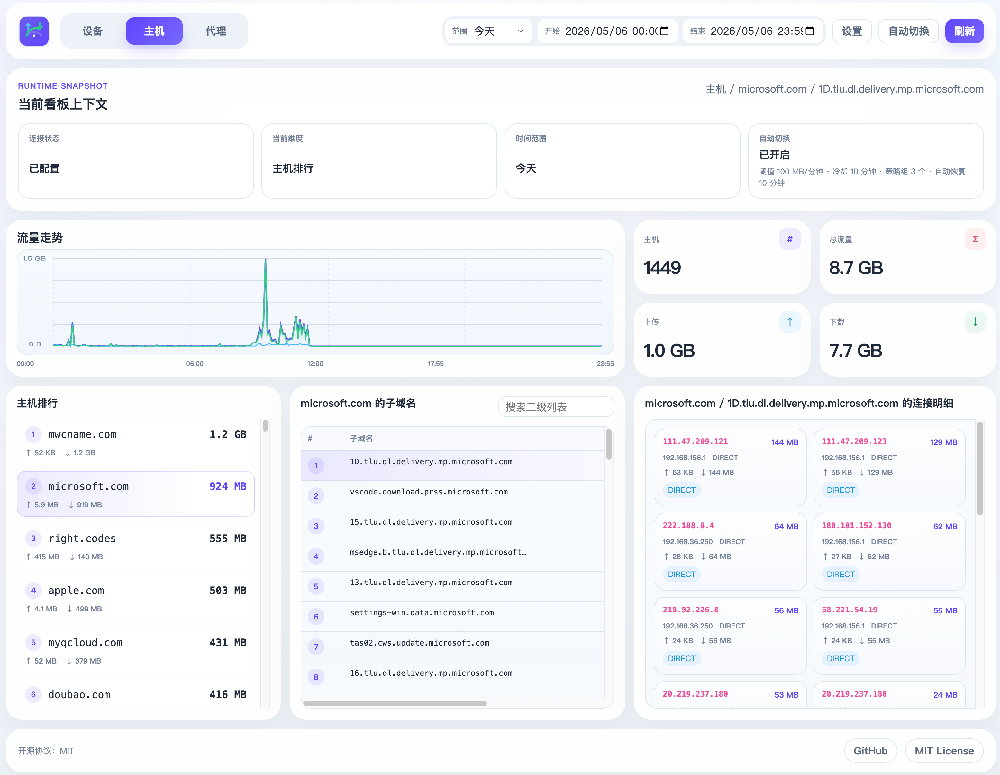

<p align="center">
  <a href="https://github.com/zhf883680/clash-traffic-monitor/stargazers"></a>
  <a href="https://hub.docker.com/r/zhf883680/clash-traffic-monitor"></a>
  <a href="https://hub.docker.com/r/zhf883680/clash-traffic-monitor"></a>
  <a href="https://hub.docker.com/r/zhf883680/clash-traffic-monitor"></a>
  
  
  
</p>

# Traffic Monitor

`Traffic Monitor` 是一个独立运行的 Clash 流量监控服务。

它会定时读取  Clash 的 `/connections` 数据，把流量增量先聚合到内存，再按分钟桶批量写入 SQLite，并提供一个内置 Web 页面，用来查看设备、主机、代理维度的流量统计和链路明细。
## 页面预览




## 怎么用

### 本地运行

推荐直接从 [Releases](https://github.com/zhf883680/clash-traffic-monitor/releases/latest) 下载对应平台的二进制文件运行。

#### Windows

下载文件：`traffic-monitor-windows-amd64.exe`

```powershell
.\traffic-monitor-windows-amd64.exe
```

#### Linux

下载文件：

- `traffic-monitor-linux-amd64`
- `traffic-monitor-linux-arm64`

```bash
chmod +x ./traffic-monitor-linux-amd64
./traffic-monitor-linux-amd64
```

```bash
chmod +x ./traffic-monitor-linux-arm64
./traffic-monitor-linux-arm64
```

#### macOS

下载文件：`traffic-monitor-macos-arm64`

```bash
chmod +x ./traffic-monitor-macos-arm64
./traffic-monitor-macos-arm64
```

如果你是从源码本地编译，也可以直接这样运行：

```bash
go build -o traffic-monitor main.go
./traffic-monitor
```

启动后访问：

```text
http://localhost:8080/
```

如果本地还没有保存过 Mihomo 配置，首次打开页面会提示填写：

- `Mihomo URL`
- `Secret`（如果 Mihomo 没有设置密钥，可以留空）

保存后会立即生效，并持久化到本地 SQLite。后续也可以在页面右上角继续修改这两个值。

### Docker 运行

```bash
mkdir -p data

docker run -d \
  --name traffic-monitor \
  --restart unless-stopped \
  -p 8080:8080 \
  -e MIHOMO_URL=http://host.docker.internal:9090 \
  -e MIHOMO_SECRET=your-secret \
  -v "$(pwd)/data:/data" \
  zhf883680/clash-traffic-monitor:latest
```

如果 Mihomo 没有设置密钥，可以把 `MIHOMO_SECRET` 留空。

升级兼容说明：

- 旧版 Docker 用户升级后，如果启动参数里仍然传了 `MIHOMO_URL` / `MIHOMO_SECRET`，新版本会继续直接使用这些值，不会影响启动。
- 启动时只要环境变量里有值，就会以环境变量为准，并自动保存到数据库。
- 如果后续移除了环境变量，但保留了 `/data` 挂载目录，服务会回退使用数据库里上次保存的值。

## 常用配置

| 变量名 | 默认值 | 说明 |
| --- | --- | --- |
| `MIHOMO_URL` | 空 | 启动时优先使用的 Mihomo Controller 地址；未设置时可在页面首次打开后填写 |
| `MIHOMO_SECRET` | 空 | Mihomo Bearer Token |
| `TRAFFIC_MONITOR_LISTEN` | `:8080` | 服务监听地址 |

## 存储策略

- 只把分钟级聚合数据写入 `traffic_aggregated`，不再持久化逐条原始连接日志。
- 聚合数据固定保留 30 天。
- 本地直接运行时，默认数据库文件是 `./data/traffic_monitor.db`。
- Docker 容器内运行时，默认数据库文件是 `/data/traffic_monitor.db`。
- 采集增量先进入内存缓冲，每 10 分钟批量刷盘一次。
- 正常运行时，页面查询会把已落盘聚合数据和当前内存缓冲一起合并，所以最近几分钟也能查到。
- 如果服务异常退出，最近最多 10 分钟、尚未刷盘的数据可能丢失。

## 项目定位

如果你已经看过 [foru17/neko-master](https://github.com/foru17/neko-master)，那你看到的是一个先做出来、而且已经非常完善的产品。它的定位更完整，覆盖了更丰富的网络流量可视化和部署能力。

这个项目没有打算和它做“功能越多越好”的正面竞争，而是走另一条路线：更轻、更直给、更适合单机或 OpenWrt 场景。

- 更轻量：Go 单二进制 + SQLite，本地就能跑起来，不需要额外的 Node.js 运行时或独立数据库。
- 更省心：前端资源直接内嵌在程序里，部署时就是一个服务或一个容器，升级和迁移都更简单。
- 更聚焦：核心目标就是盯住  Clash 的 `/connections` 流量，把设备、主机、出口节点和明细钻取做好。
- 更适合小设备：更贴近旁路由、软路由、OpenWrt 这类“资源有限但想快速看流量”的使用场景。
- 更容易二次定制：代码结构短、依赖少，想自己加维度、调样式、改展示逻辑会更直接。
- 更省磁盘 IO：运行时只持久化 30 天分钟级聚合数据，最近最多 10 分钟保存在内存缓冲里统一刷盘。

## 备注

因为这个项目主要监控运行在 OpenWrt路由器 环境的 Clash，当前默认移除了进程维度相关展示。

如果你需要进程模块，可以在此基础上自行 fork 后补充。

## 致谢

页面接口参考了 [MetaCubeX/metacubexd](https://github.com/MetaCubeX/metacubexd)。  
[LinuxDO](https://linux.do) — the community where it all began
